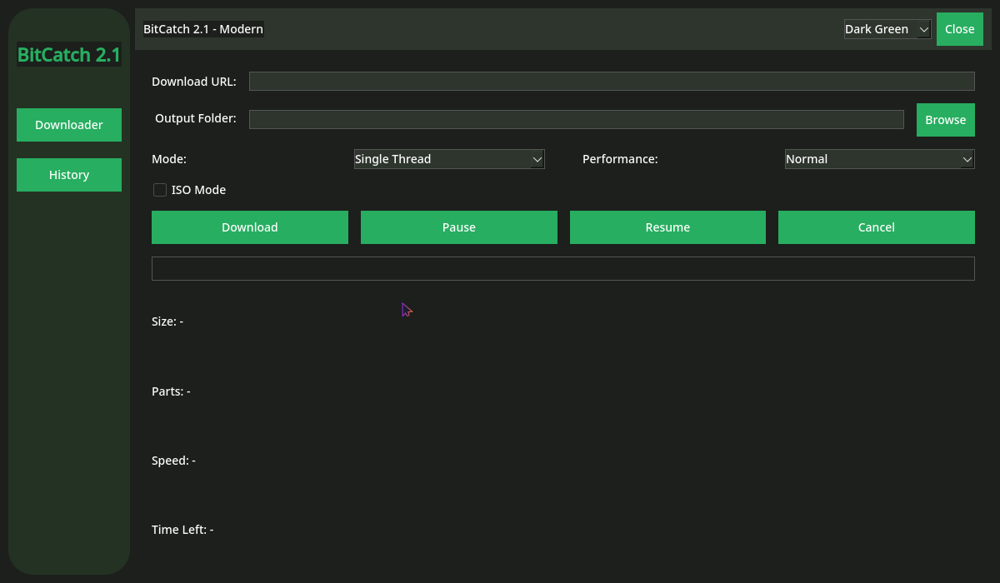
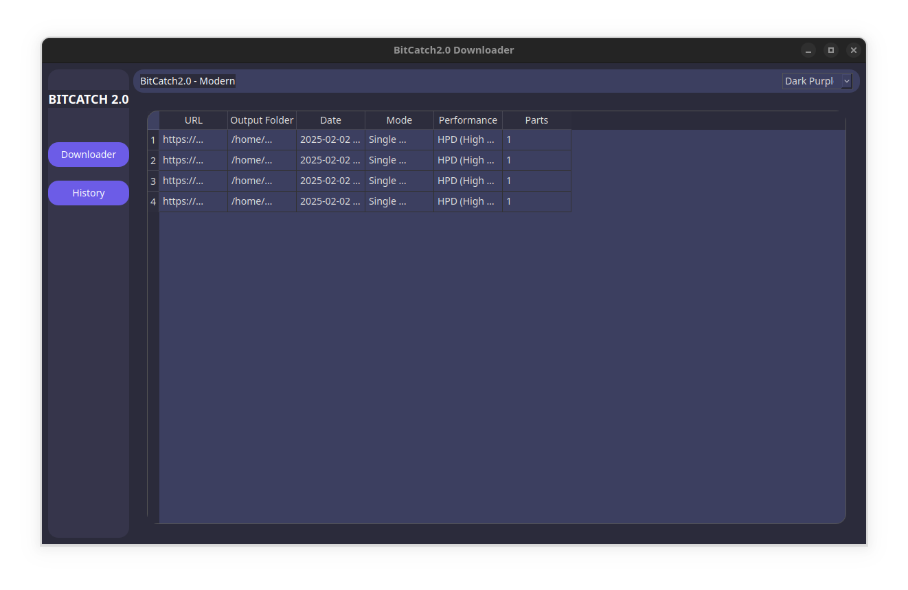

# BitCatch2.1 Downloader ⚡



A modern, dark-themed downloader application built with Python and PyQt5/PySide6.  
The new BitCatch2.1 version uses PySide6 for a modern look and performance, while the legacy BitCatch2.0 version is available with PyQt5.

---

## Key Features 🔥
- Safe for ISO files  
- Single-Thread or Multi-part download modes  
- Pause/Resume/Cancel downloads anytime  
- HPD (High Performance) mode for faster downloads  
- Five dark themes to choose from  
- Simple history of past downloads (saved in `history.json`)

---

## Preview 🎨



---

## Installation ⚙

1. **Clone** or **download** this repository.  
2. **Install dependencies**:

   - For **BitCatch2.1 (new version)** using **PySide6**:
     ```bash
     pip install PySide6 requests
     ```
     
   - For **legacy BitCatch2.0** (with **PyQt5**):
     ```bash
     pip install pyqt5 requests
     ```

3. **Run the application**:
   ```bash
   python main.py
